# Logistics Integration Co-pilot - Architectural Document

## Table of Contents
1. [Executive Summary](#executive-summary)
2. [Application Overview](#application-overview)
3. [System Architecture](#system-architecture)
4. [Core Components](#core-components)
5. [Data Models](#data-models)
6. [Technology Stack](#technology-stack)
7. [Core Workflows](#core-workflows)
8. [External Integrations](#external-integrations)
9. [Security Architecture](#security-architecture)
10. [Deployment Architecture](#deployment-architecture)
11. [Performance Considerations](#performance-considerations)
12. [Development & CI/CD](#development--cicd)

---

## Executive Summary

The **Logistics Integration Co-pilot** is an AI-powered web application that generates production-ready API integration code for logistics, e-commerce, and payment platforms. Built with React, TypeScript, and Vite, it leverages Google's Gemini 2.5 models to provide developers with instant code scaffolding for complex API integrations.

### Key Value Propositions
- **Rapid Development**: Generate production-ready Python and Node.js integration code in seconds
- **Multi-Platform Support**: Pre-configured for 10+ major logistics/e-commerce platforms
- **AI-Driven Intelligence**: Context-aware code generation with credential injection and best practices
- **Developer-Friendly**: Copy-ready code with realistic sample data and deployment guidance

---

## Application Overview

### Purpose
Accelerate logistics API integration development by automating boilerplate code generation, authentication patterns, and data transformation templates through conversational AI assistance.

### Target Users
- **Integration Developers**: Building e-commerce/logistics platform connections
- **DevOps Engineers**: Setting up API orchestration workflows  
- **Solution Architects**: Designing multi-platform integration strategies
- **Technical Consultants**: Rapid prototyping for client demonstrations

### Core Capabilities
1. **Conversational Code Generation**: Natural language to executable code
2. **Multi-Language Output**: Simultaneous Python (requests) and Node.js (axios) generation
3. **Platform-Specific Authentication**: Pre-configured credential patterns for major APIs
4. **Sample Data Generation**: Realistic API response mocking for development/testing
5. **Best Practices Integration**: Built-in error handling, pagination, and retry logic

---

## System Architecture

### High-Level Architecture


### Deployment Architecture


---

## Core Components

### Frontend Components


### Service Layer Architecture


---

## Data Models

### Core Data Structures


### Platform Configuration Schema


### State Management Flow


---

## Technology Stack

### Frontend Stack

| **Category** | **Technology** | **Version** | **Purpose** |
|--------------|----------------|-------------|-------------|
| **Framework** | React | 19.1.1 | Component-based UI development |
| **Language** | TypeScript | 5.8.2 | Type-safe JavaScript development |
| **Build Tool** | Vite | 6.2.0 | Fast development server and bundling |
| **Styling** | Tailwind CSS | CDN | Utility-first CSS framework |
| **Fonts** | Google Fonts | - | Montserrat (headings) + Open Sans (body) |
| **Icons** | Custom SVG | - | Optimized icon components |

### Backend Stack

| **Category** | **Technology** | **Version** | **Purpose** |
|--------------|----------------|-------------|-------------|
| **Runtime** | Node.js | 18+ | JavaScript runtime environment |
| **Framework** | Express | 4.19.2 | Lightweight HTTP server |
| **HTTP Client** | node-fetch | 3.3.2 | Server-side HTTP requests |
| **CORS** | cors | 2.8.5 | Cross-origin resource sharing |
| **AI SDK** | @google/generative-ai | 0.11.3 | Google Gemini API integration |

### Development & Tooling

| **Category** | **Technology** | **Version** | **Purpose** |
|--------------|----------------|-------------|-------------|
| **Linting** | ESLint | 9.11.0 | Code quality enforcement |
| **Type Checking** | TypeScript | 5.8.2 | Static type analysis |
| **Package Manager** | npm | - | Dependency management |
| **CI/CD** | GitHub Actions | - | Automated testing and deployment |
| **Version Control** | Git | - | Source code management |

### External Dependencies


---

## Core Workflows

### User Code Generation Workflow


### Platform Configuration Workflow

```mermaid
sequenceDiagram
    participant U as User
    participant UI as Sidebar Component
    participant C as Config Manager
    participant LS as Local Storage
    
    U->>UI: Select platform from dropdown
    UI->>C: Get platform field specifications
    C->>UI: Return field specs for platform
    UI->>U: Render dynamic credential form
    
    U->>UI: Enter credential values
    UI->>C: Update integration config
    C->>LS: Persist config with platform:field keys
    C->>UI: Confirm config updated
    
    Note over C,LS: Storage pattern:<br/>"Shopify:storeDomain" → "mystore.myshopify.com"<br/>"Shopify:accessToken" → "shpat_***"
```



### Error Handling & Recovery Workflow


### AI Prompt Engineering Workflow


---

## External Integrations

### AI Platform Integration


### Supported Platform Ecosystem


### Authentication Patterns by Platform

| **Platform** | **Auth Method** | **Required Credentials** | **Scope Management** |
|-------------|----------------|------------------------|---------------------|
| **Shopify** | Private App Token | storeDomain, accessToken | Admin API permissions |
| **Amazon** | LWA OAuth 2.0 | clientId, clientSecret, refreshToken | SP-API scopes |
| **Stripe** | API Key | secretKey | Restricted/unrestricted keys |
| **Square** | OAuth 2.0 | accessToken | Application permissions |
| **BigCommerce** | OAuth 2.0 | storeHash, clientId, accessToken | Store-level permissions |
| **WooCommerce** | Basic Auth | consumerKey, consumerSecret | User role permissions |
| **Magento** | Bearer Token | accessToken | Admin user permissions |
| **ShipStation** | Basic Auth | apiKey, apiSecret | Account-level access |
| **Etsy** | OAuth 1.0 | apiKey, sharedSecret | Application permissions |
| **Generic WMS** | API Key | baseUrl, apiKey | System-defined |

---

## Security Architecture

### Security Model Overview


### Credential Security Flow

```mermaid
sequenceDiagram
    participant U as User
    participant C as Client
    participant LS as Local Storage
    participant P as Proxy Server
    participant API as External API
    
    Note over U,API: Development Flow (Direct Client Access)
    U->>C: Enter platform credentials
    C->>LS: Store with platform:field keys
    C->>API: Direct API calls with credentials
    
    Note over U,API: Production Flow (Proxy Pattern)
    U->>C: Enter platform credentials
    C->>LS: Store credentials locally
    C->>P: Send request (credentials in payload)
    P->>API: Proxy request with server-side API key
    API->>P: Return response
    P->>C: Forward response (strip sensitive data)
    
    Note over LS: Security Measures:<br/>• Local storage only<br/>• No server persistence<br/>• Browser isolation
```



### Environment Security Configuration


---

## Deployment Architecture

### Development Deployment


### Production Deployment Options


### CI/CD Pipeline


---

## Performance Considerations

### Frontend Performance Optimizations

```mermaid
graph TB
    subgraph "Bundle Optimization"
        TreeShaking[Tree Shaking<br/>Unused Code Elimination]
        CodeSplit[Code Splitting<br/>Dynamic Imports]
        Minification[Minification<br/>Asset Compression]
    end
    
    subgraph "Runtime Performance"
        LazyLoading[Lazy Loading<br/>Component Lazy Loading]
        Memoization[React Memoization<br/>Expensive Computations]
        VirtualScroll[Virtual Scrolling<br/>Large Lists]
    end
    
    subgraph "Asset Optimization"
        ImageOpt[Image Optimization<br/>WebP Format]
        FontOpt[Font Optimization<br/>Font Display Swap]
        CDN[CDN Usage<br/>External Resources]
    end
    
    subgraph "Caching Strategy"
        BrowserCache[Browser Caching<br/>Static Assets]
        ServiceWorker[Service Worker<br/>Offline Support]
        StateCache[State Caching<br/>Conversation History]
    end
    
    TreeShaking --> LazyLoading
    CodeSplit --> Memoization
    Minification --> VirtualScroll
    
    ImageOpt --> BrowserCache
    FontOpt --> ServiceWorker
    CDN --> StateCache
    
    classDef bundle fill:#e3f2fd
    classDef runtime fill:#e8f5e8
    classDef asset fill:#fff3e0
    classDef cache fill:#f3e5f5
    
    class TreeShaking,CodeSplit,Minification bundle
    class LazyLoading,Memoization,VirtualScroll runtime
    class ImageOpt,FontOpt,CDN asset
    class BrowserCache,ServiceWorker,StateCache cache
```

### Backend Performance Considerations

| **Aspect** | **Current Implementation** | **Production Optimization** |
|------------|---------------------------|------------------------------|
| **API Calls** | Direct client-to-Gemini | Proxy with connection pooling |
| **Model Resolution** | Runtime probing | Cached model availability |
| **Response Processing** | Synchronous JSON parsing | Stream processing |
| **Error Handling** | Client-side retry logic | Server-side circuit breaker |
| **Rate Limiting** | None (Gemini API limits) | Application-level throttling |
| **Caching** | None | Response caching for common prompts |

### Performance Metrics & Monitoring

```mermaid
graph LR
    subgraph "Client Metrics"
        LCP[Largest Contentful Paint<br/>< 2.5s target]
        FID[First Input Delay<br/>< 100ms target]
        CLS[Cumulative Layout Shift<br/>< 0.1 target]
    end
    
    subgraph "Application Metrics"
        TTI[Time to Interactive<br/>Usability measure]
        Bundle[Bundle Size<br/>< 500KB target]
        Cache[Cache Hit Rate<br/>Asset efficiency]
    end
    
    subgraph "AI Performance"
        Latency[AI Response Time<br/>< 5s target]
        Success[Success Rate<br/>> 95% target]
        Throughput[Requests/minute<br/>Capacity planning]
    end
    
    LCP --> TTI
    FID --> Bundle
    CLS --> Cache
    
    TTI --> Latency
    Bundle --> Success
    Cache --> Throughput
    
    classDef web fill:#e3f2fd
    classDef app fill:#e8f5e8
    classDef ai fill:#fff3e0
    
    class LCP,FID,CLS web
    class TTI,Bundle,Cache app
    class Latency,Success,Throughput ai
```

---

## Development & CI/CD

### Development Workflow

```mermaid
gitgraph
    commit id: "Initial Setup"
    commit id: "Core Components"
    
    branch feature/ai-integration
    checkout feature/ai-integration
    commit id: "Gemini Service"
    commit id: "Model Resolution"
    commit id: "JSON Parsing"
    
    checkout main
    merge feature/ai-integration
    
    branch feature/ui-components
    checkout feature/ui-components
    commit id: "Chat Interface"
    commit id: "Code Display"
    commit id: "Error Handling"
    
    checkout main
    merge feature/ui-components
    
    branch feature/platform-support
    checkout feature/platform-support
    commit id: "Integration Fields"
    commit id: "Platform Config"
    commit id: "Credential Management"
    
    checkout main
    merge feature/platform-support
    
    commit id: "Production Hardening"
    commit id: "CI/CD Setup"
    commit id: "Documentation"
```

### Code Quality Gates

```mermaid
flowchart TD
    Start([Code Commit]) --> Lint{ESLint Pass?}
    Lint -->|Fail| LintFix[Fix Linting Issues]
    Lint -->|Pass| TypeCheck{TypeScript Check?}
    
    TypeCheck -->|Fail| TypeFix[Fix Type Issues]
    TypeCheck -->|Pass| Build{Build Success?}
    
    Build -->|Fail| BuildFix[Fix Build Issues]
    Build -->|Pass| Test{Tests Pass?}
    
    Test -->|Fail| TestFix[Fix Test Issues]
    Test -->|Pass| Deploy[Deploy to Staging]
    
    LintFix --> Start
    TypeFix --> Start
    BuildFix --> Start
    TestFix --> Start
    
    Deploy --> Review[Manual Review]
    Review --> Production[Deploy to Production]
    
    classDef gate fill:#fff3e0
    classDef fix fill:#ffcdd2
    classDef success fill:#c8e6c9
    
    class Lint,TypeCheck,Build,Test gate
    class LintFix,TypeFix,BuildFix,TestFix fix
    class Deploy,Production success
```

### Package Scripts & Commands

| **Script** | **Command** | **Purpose** |
|------------|-------------|-------------|
| `dev` | `vite` | Start development server |
| `dev:proxy` | `node --env-file=.env server/index.js` | Start backend proxy |
| `build` | `vite build` | Build production bundle |
| `preview` | `vite preview` | Preview production build |
| `lint` | `eslint . --ext .ts,.tsx --max-warnings=0` | Run linting with zero warnings |
| `typecheck` | `tsc --noEmit` | Type checking without emission |
| `ci` | `npm run lint && npm run typecheck && npm run build` | Complete CI pipeline |

### Project Structure Conventions

```
logistics-integration-wizard/
├── 📁 components/              # React components
│   ├── 📁 icons/              # SVG icon components
│   ├── 📄 ChatInterface.tsx   # Main chat container
│   ├── 📄 Sidebar.tsx         # Configuration panel
│   └── 📄 *.tsx               # Feature components
├── 📁 services/               # Business logic layer
│   └── 📄 geminiService.ts    # AI integration service
├── 📁 public/                 # Static assets
│   ├── 📁 images/             # Image assets
│   └── 📁 videos/             # Video assets
├── 📁 server/                 # Backend proxy (optional)
│   └── 📄 index.js            # Express server
├── 📁 .github/workflows/      # CI/CD configuration
│   └── 📄 ci.yml              # GitHub Actions workflow
├── 📄 App.tsx                 # Root application component
├── 📄 types.ts                # TypeScript type definitions
├── 📄 constants.ts            # Application constants
├── 📄 integrationFields.ts    # Platform specifications
├── 📄 vite.config.ts          # Build configuration
├── 📄 tsconfig.json           # TypeScript configuration
├── 📄 eslint.config.js        # ESLint configuration
├── 📄 package.json            # Dependencies and scripts
└── 📄 README.md               # Project documentation
```

---

## Conclusion

The Logistics Integration Co-pilot represents a modern, AI-powered approach to rapid API integration development. Its architecture balances developer productivity with production-ready security and performance considerations.

### Key Architectural Strengths

1. **Modular Component Design**: Clean separation of concerns with reusable React components
2. **Type-Safe Development**: Comprehensive TypeScript coverage for reduced runtime errors
3. **Flexible AI Integration**: Robust model fallback and error handling for reliable AI responses
4. **Security-First Approach**: Local credential storage with production proxy patterns
5. **Developer Experience**: Hot module reloading, linting, and comprehensive tooling

### Future Enhancement Opportunities

1. **Enhanced AI Capabilities**: Stream processing, multi-turn conversations, code explanation
2. **Extended Platform Support**: Additional APIs, custom platform definitions
3. **Advanced Security**: Credential encryption, audit logging, rate limiting
4. **Performance Optimization**: Response caching, bundle splitting, service workers
5. **Enterprise Features**: Team collaboration, template sharing, usage analytics

This architecture provides a solid foundation for scaling both the technical complexity and user base of the application while maintaining high standards for security, performance, and developer experience.